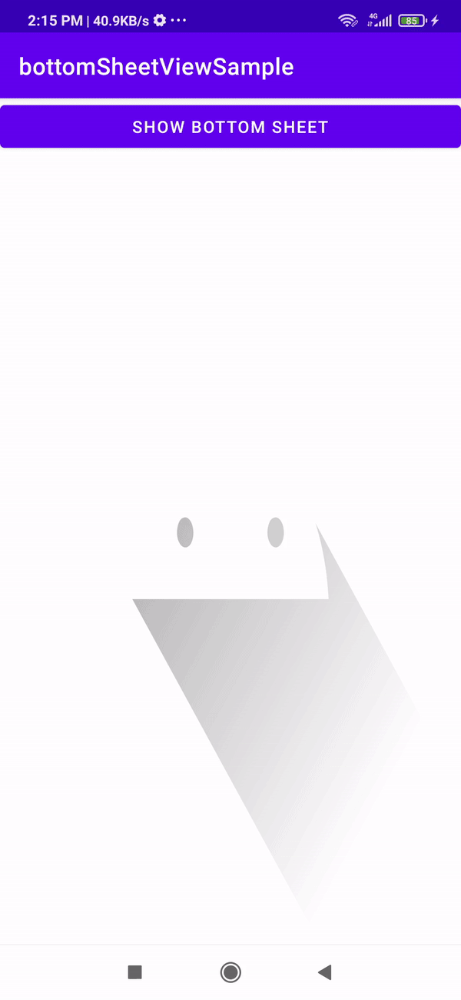

# CustomBottomSheet
Custom Bottom Sheet with a fixed view at the bottom of the page

BottomSheet is an Android component that presents a dismissible view from the bottom of the screen. you can't have a fixed view at bottom of the screen when sliding. To resolve this problem, we developed this library to set a sliding view and a bottom view that fixed at the bottom of the page.

## License 

    Copyright (C) 2020 Naser Karimi

    Licensed under the Apache License, Version 2.0 (the "License");
    you may not use this file except in compliance with the License.
    You may obtain a copy of the License at

       http://www.apache.org/licenses/LICENSE-2.0

    Unless required by applicable law or agreed to in writing, software
    distributed under the License is distributed on an "AS IS" BASIS,
    WITHOUT WARRANTIES OR CONDITIONS OF ANY KIND, either express or implied.
    See the License for the specific language governing permissions and
    limitations under the License.

